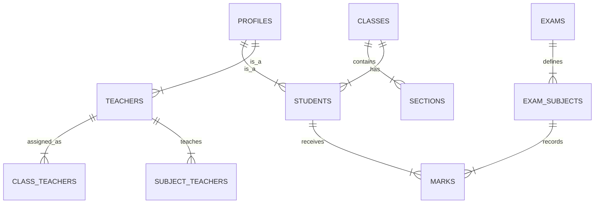

# Database Schema Documentation

## 1. Overview
The database is hosted on **Supabase (PostgreSQL)**. It uses a relational model with strict Foreign Key constraints to ensure data integrity. Security is enforced via **Row Level Security (RLS)** policies.

## 2. ER Diagram (Simplified)

## 3. Key Tables

### User Tables
-   **`profiles`**: The central table linking to `auth.users`. Stores Common info (Name, Email, Role, Avatar).
-   **`students`**: Extends profile. Stores Admission No, Parent Info, Class ID.
-   **`teachers`**: Extends profile. Stores Qualification, Dept.

### Academic Structure
-   **`academic_years`**: Defines sessions (e.g., 2024-2025).
-   **`classes`**: Standard classes (1, 2, ... 10).
-   **`sections`**: Divisions (A, B, C) linked to Classes.
-   **`subjects`**: Global subject list.

### Operations
-   **`attendance_registers`**: Header table for a day's attendance. Status: `draft` | `finalized`.
-   **`attendance_records`**: Individual student status linked to Register.
-   **`homework`**: Assignments created by teachers.
-   **`student_notes`**: Remarks added by teachers for specific students.

### Systems & Security
-   **`system_settings`**: Global config (App Block, Maintenance Mode).
-   **`audit_logs`**: Tracks admin actions.
-   **`push_tokens`**: Stores Expo Push Tokens for notifications.

## 4. Row Level Security (RLS) Rules
RLS is the primary defense layer. It works as follows:

| Table | Policy Summary |
| :--- | :--- |
| **profiles** | Public Read (needed for associations). Update Own Only. |
| **students** | Teachers/Admins View All. Students View SELF Only. |
| **marks** | Teachers Insert/View. Students View SELF Only. |
| **attendance** | Teachers Manage. Students View SELF Only. |
| **system_settings** | Public Read. Admins Manage. |

## 5. Storage Buckets
-   **`avatars`**: Publicly readable profile pictures.
-   **`marksheets`**: PDF/Image results.
    -   *Read*: Public (or Authenticated User).
    -   *Upload*: Authenticated Users (Admins/Teachers).

## 6. Management
The entire schema is defined in a single source-of-truth file:
`backend/master_schema.sql`
Run this script to reset or initialize the database.
