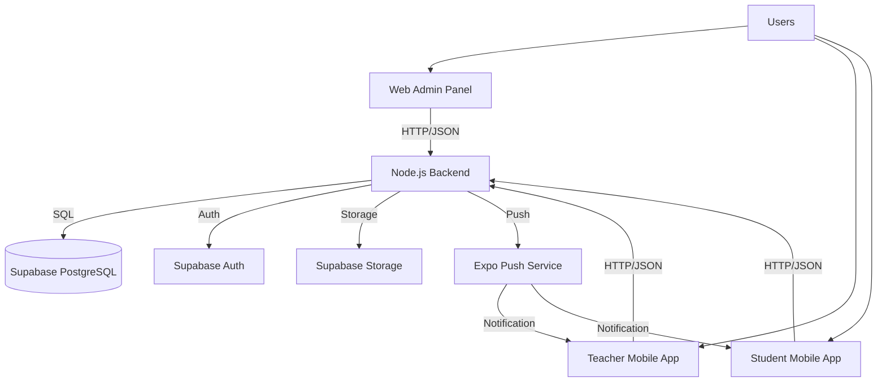

# School ERP System - Project Overview

## 1. Introduction
The **School ERP System** is a comprehensive, full-stack educational management solution designed to streamline administrative tasks, enhance teacher productivity, and provide students and parents with real-time academic insights. The system is built with a modern technology stack, ensuring scalability, security, and cross-platform compatibility.

## 2. System Architecture
The ecosystem consists of three main client applications and a centralized backend:

## 3. Technology Stack

### Backend & Database
- **Runtime**: Node.js with Express.js
- **Database**: PostgreSQL (managed by Supabase)
- **Authentication**: Supabase Auth (JWT based)
- **Storage**: Supabase Storage (S3 compatible)
- **Hosting**: Render (Web Service)

### Frontend Applications
1.  **Web Admin Panel**: 
    -   Built with **Next.js** (React)
    -   Styled with React Bootstrap & SCSS
    -   Hosted on Netlify (Static Export)
    
2.  **Mobile Apps (Teacher & Student)**:
    -   Built with **React Native (Expo)**
    -   Navigators: React Navigation (Stack & Tabs)
    -   Notifications: Expo Notifications
    -   Build Tool: Expo EAS

## 4. Core Modules

### 🎓 Student Management
- Complete profile management (Admission No, Roll No, Personal Details).
- Class and Section mapping.
- Parent contact details.

### 👩‍🏫 Teacher Management
- Profile management with qualification and department.
- Class Teacher and Subject Teacher assignments.

### 📅 Attendance System
- Digital attendance marking by teachers.
- Daily/Monthly reports.
- Real-time visibility for students/parents.
- **Strict Logic**: Changes allowed only before finalization.

### 💰 Fee Management
- Dynamic fee structures per class.
- Payment tracking (Paid, Pending, Partial).
- **Locking Mechanism**: Restricts access to marksheets if fees are overdue.

### 📝 Exams & Results
- Exam scheduling and subject mapping.
- Marks entry by teachers.
- Digital Marksheet generation (PDF/Image upload).
- Weighted averages and grading interpretation.

### 🚌 Transport Module
- Bus and Driver management.
- Route assignment.
- Student-Bus linking.

### 🔔 Communication
- **Notice Board**: Global or targeted announcements (Students/Teachers).
- **Push Notifications**: Instant alerts for homework, attendance, and notices.
- **Inbox**: In-app message history for students.

## 5. Security Highlights
- **Role-Based Access Control (RBAC)**: Strict segregation between Admin, Teacher, and Student roles on both Frontend and Backend (RLS).
- **Row Level Security (RLS)**: Database-level enforcement ensuring students can only access their own data.
- **Secure API**: All endpoints validated via Supabase JWT middleware.
- **Fee Locks**: Server-side enforcement preventing fee defaulters from viewing sensitive academic data.

## 6. Deployment
- **Backend Setup**: Automated deployment on Render.
- **Mobile Builds**: "Safe Build" strategy using EAS (Expo Application Services) separately from main logic.
- **Database**: Managed via consolidated SQL scripts (`master_schema.sql`).
